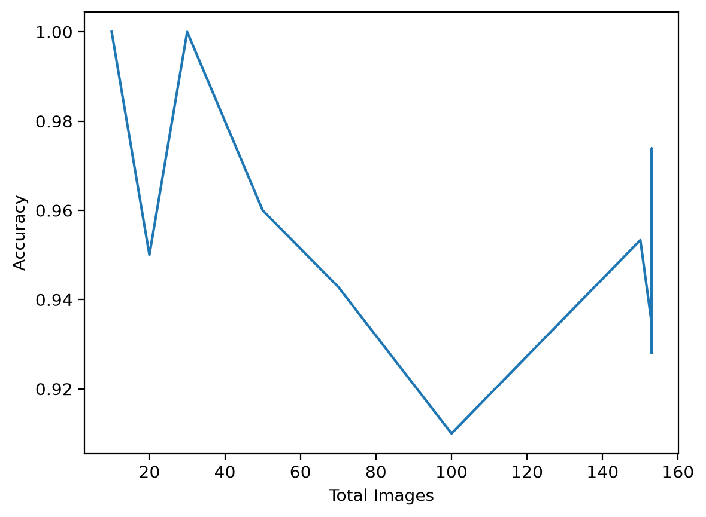

# Handwritten Digit Classifier

This is a small project I built to understand how image classification works from scratch. Instead of using a pre-packaged dataset like MNIST, I collected all the data myself through a drawing canvas built with Streamlit. Every 28x28 grayscale image in the dataset is my own handwriting.

## How it works

The app has two pages. On the Draw page, you select a digit from 0 to 9, draw it on a 280x280 canvas, and press Add to save it. Once you have enough samples, you can switch to the Analytics page to train a basic convolutional neural network. The architecture is straightforward: two Conv2D layers with MaxPooling, a Flatten layer, a Dense layer with 128 units, and a final Dense layer with softmax. It trains for 5 epochs with a batch size of 10, which is sufficient for a dataset this size.

There is also a Guess feature. You draw a digit, enter the correct answer, and the model attempts to predict it. The image is then saved to the correct folder regardless of whether the prediction was right or wrong, so the dataset grows automatically as you use the app.

## Data

I collected the images myself using the built-in drawing board. Because the dataset is small, the results are not fully reliable. You can see the model's accuracy fluctuate as more images are added. Early on it sometimes reaches perfect accuracy because it is effectively memorizing a handful of samples, then it drops when it has to generalise across a more varied set. That behaviour is expected with limited data.

## Results

Below is the accuracy plotted against the total number of training images:



The model starts with high accuracy when there are very few samples, then dips around 100 total images, and gradually climbs back up as the dataset becomes more diverse. It is not perfect, but it demonstrates how accuracy evolves as you add more handwritten examples.

## Running it

Install dependencies:
```
pip install streamlit streamlit-drawable-canvas opencv-python numpy matplotlib tensorflow
```

Launch:

```
streamlit run source/main.py
```